# Forecasting the Future of COVID-19 with Social Distancing 
## Table of Contents

<!-- vscode-markdown-toc -->
  1. [Introduction](#Introduction)
  2. [Data + Cleaning](#DataCleaning)
  3. [Exploratory Data Analysis](#ExploratoryDataAnalysis)
  4. [Model Results and Forecasting Per State](#ModelResultsandForecastingPerState) 
		  4.1. [California](#California) 
		  4.2. [Kentucky](#Kentucky) 
		  4.3. [New Mexico](#NewMexico) 
		  4.4. [North Carolina](#NorthCarolina) 
		  4.5. [Ohio](#Ohio) 
		  4.6. [Oregon](#Oregon) 
		  4.7. [Tennessee](#Tennessee) 
  5. [Conclusion](#Conclusion)
  6. [Future Ideas for Improvement](#FutureIdeasforImprovement)
  7. [Data Sources / References](#DataSourcesReferences)

<!-- vscode-markdown-toc-config
	numbering=true
	autoSave=true
	/vscode-markdown-toc-config -->
<!-- /vscode-markdown-toc -->

##  1. Introduction

The question on everyone's mind these days seems to be the same: when will things go back to normal? The United States has been hit especially hard by the COVID-19 pandemic and we are all hoping that the end is in sight. With the implementation of social distancing playing a massive role in our lives today, what level of social distancing should be maintained so that we see a consistent drop in the number of new cases of the virus? 

In this project, I have created a model that will predict a forecast of daily new cases per capita for a state currently experiencing the maximum number of cases with different levels of social distancing by drawing a subset of states similar in population density that are further along in recovery by normalizing the data to days since outbreak in each state, and training a random forest model on the data and using it to assess the most effective areas of social distancing and make predictions on the future.

##  2. Data + Cleaning

I used 4 different datasets for this study and combined them into a single DataFrame for analysis and prediction.

New York Times: Github Repo of cases/deaths daily per state 
The New York Times offers dataset on the number of cases and deaths by COVID-19 per each state. I created a new column of daily new cases and divided these numbers by the state's population for each state for a fairer comparison from state to state, resulting in new cases per 1 million residents. To smooth out the many spikes in the number of new cases per day, I used a 7 day moving average and used this as the target variable.

Apple: Mobility Data 
Apple offers a dataset on mobility that breaks categories into walking, driving, and transit. Unfortunately, walking and transit data are only available on a national and/or city level so I was only able to get driving data from this set. These data are reported as compared to a percentage of the baseline value measured on January 13th - this number was converted by 100 to get a multiplier of normal for each day. A 7 day moving average set 7-10 days in the past was then applied on this data.

Google: Global Mobility Data 
From Google, I was able to get a massive dataset detailing mobility trends througout the past few months at grocery stores/ pharmacies, parks, transit stations, retail/recreation outlets, residential, and workplaces. This data was reported as the percent change from the baseline, the median value, for the corresponding day of the week, during the 5-week period Jan 3–Feb 6, 2020. To make this measurement consistent with the apple data, I added 100 and divided by 100 to get a multiplier of normal for each day. I also used a 7-10 day delayed 7 day moving average for these features as well, so that weekend trends were avoided and any correlation would be easier to see.

World Population Review 
I obtained state population density from the world population review and implemented it into my dataframe in order to create subsets states similar in population density.

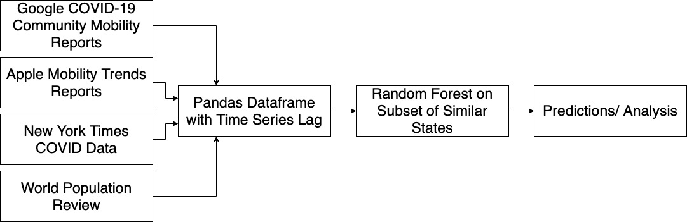

Each of the preceeding datasets were combined into one Pandas DataFrame and cleaned. For missing mobility/social distancing entries, the average of the next surrounding values was used. A 21 day time lagged series of the target value (Daily New Cases) was then applied. In total, the dataset consistented of 30 features: 21 time lagged daily new cases, days since outbreak, 7 social distancing features, and state population density.

In order to determine the set of states to create predictions for a specific state, the model will take a subset of states with similar population densities that are further ahead in recovering from the virus. The date values are then normalized so that that daily new cases curves were as closely aligned as possible by defining a start of the outbreak as the time on which the daily number of new cases reached a certain percentage (subjective based on the subset of states selected, and model performance). A random forest is trained on the dataset for this subset of states, and then the random forest model is applied to original state to make predictions and draw insights for the specific state. 

In predicting future values, the high and low public activity levels are determined by the minimum and maximum levels of social distancing, respectively, found in the training set of similar states.

Please note that this model has two assumptions:
1. Medical knowledge/awareness of virus is correlated with time since first infections
2. Population distribution throughout each individual state is uniform (for simplicity - this project could be reworked on a county by county basis that would likely make a uniform population distribution more feasible)

Please see the Model Results and Forecasting per State section for examples of this model on several different states.

##  3. Exploratory Data Analysis
Although there has been news about a shortage of tests being available for the virus in the USA, the data show a very heavy correlation between deaths and new cases, so I decided to focus on new cases instead of deaths, as there is data earlier and a greater amount of data available for cases. 

Since COVID-19 hit the state of New York first, and the state is currently showing strong signs of recovery, I used New York as the focus of my preliminary EDA. I sorted the data available by the maximum number of daily cases and plotted them. Shown below are the states that have had the highest number of new cases in the United States before a moving average was applied.

Shown below is an early random forest model based on the state of New York; since it has shown a strong negative trend, states that show this kind of pattern are helpful to train models to help similar states who are currently at their maximum number of cases.

*Please note that the figure above represents the data available as of early May 2020.

Looking at plots of New Cases versus the amount of public activity before the social distancing moving average delay parameter was set, there seems to be a surprising negative trend between social distancing attributes and daily new cases per population. There seems to be a positive rate of of new cases to presence at home, which is also the opposite of what I was expecting.

To get a better visual of how each mobility trend may relate to the new number of cases each day, I scaled each feature data point to a fraction of its maximum value in the interval closest to the peak of the plot. It definitely appears as though a decrease in activity to various venues is followed by a decrease in new cases. Something noteable I found is that there are several spikes in outside activity from mid April and a temporary increase in new cases a few days later. It definitely appears that social distancing affects the number of new cases, but with a time lag, which is likely why these trends were not as apparent on the scatter matrices. Based on my research, it takes 2-14 days for symptoms of COVID-19 to develop after infection; this figure seems consistent with this, hence the reasoning for 7-10 day in delay of social distancing parameters from their current day (this parameter was modified in several models to adjust performance).

Something notable in this plot is there seems to be an explosion in activity in the later portion of the data, concurrent with a sharp decrease in the number of new cases. Looking at previous trends, I don't think converging to 0 anytime soon is going to be very likely.

After collecting information for New York, I decided to investigate states that are further behind in recovery. I can use information from recovered states, such as New York, to train a model and come up with insights for states currently in the peak of outbreak. This model will aid in coming up with input as to where social distancing efforts should be focused, and how much.

The bar graph below illustrates the extent of recovery for the least recovered states in the country.

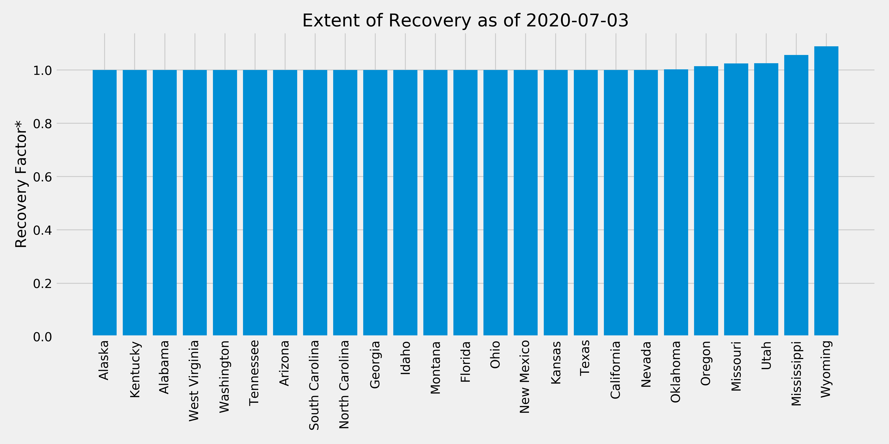

* Recovery factor is defined as the number of maximum new cases divided by the most recent number of cases for that specific state.

The states with a recovery factor of 1 are experiencing more new cases per person than ever before. By training a random forest model of a subset of states that are similar in population density as these states and futher along in recovery, I can extract insights that could help theses states with the most effective features that are likely to reduce the number of daily new cases in the future.

##  4. Model Results and Forecasting Per State

The criteria for states to predict and draw insights for are as follows:
- Low recovery factor
- There are other states with similar population densities
- These states have higher rates of recovery

The following states that meet this criteria best as of July 3, 2020 are California, Kentucky, New Mexico, North Carolina, Ohio, Oregon, and Tennessee. These states are analyzed below.

####  4.1. California

The first step of the model is to select a subset of states with similar population densities as California. With a minimum recovery factor of 1.3 (1.3 times as many new cases were recorded at the maximum as the most recent reporting - moving average applied) and a population density within plus or minus 40 people per square mile, the resulting states are plotted below.

The curves shown peak in different places, and resemble a variety of different shapes. In order to assess how these states from the training sets practiced social distancing to decrease the number of new cases, the data needs to be normalized to get the peaks to overlap as much as possible, and then determine the number of days since the outbreak reached a certain percentage of maximum daily cases.

The normalized plot for states similar to California is shown below. To create this model, the following parameters were used for this model were used in order to get the curves aligned to one another as much as possible: a defined starting of outbreak at 37% of the maximum cases, and a train/test split at 45 days after the outbreak start.

Once the model has a time series lag implemented on it, the time lagged subset of similar states can be trained on a Random Forest Regressor model. The time lagged DataFrame after a certain day for the California dataset was reset to remove any leakage of known values to similate predicting the future, but the social distancing parameters were untouched (so that they can be used to test the validity for predicting the future number of new cases). The random forest model trained on the subset of similar states was then applied on the Alabama dataset to create predictions on the known values, and then predictions based on these predictions were applied into the dataframe and applied to the time lagged values for the rest of the days in the dataset. 

By tweaking the social distance delay to 7 days and modifying the aforementioned train/test split and outbreak start definition, the simulated predictions and the actual observed values are shown below.

The model does a good job predicting trends in the data, though doesn't seem to be as sensitive as the actual data itself.

Based on the random forest model, the most important features are shown below. Public presence in parks seems to be the most important social distancing feature for this subset of states. The next most important features in order are: people staying at home, days elapsed since outbreak, activity at workplaces, retail/recreation centers, driving, grocery stores and pharmacy activity, transit stations, and state population density.

To determine the individual effect of these features, individual conditional expectation (ICE) plots are generated below. The fractional levels of public activity relative to pre-pandemic levels (January 2020) are plotted against the esimated number of daily new cases with all other factors held constant.

Based on the ICE curves, keeping park attendence below 0.9 times as much as normal levels will likely reduce the number of new cases in the future. I would also encourage Californians to stay home at least 18% more than they did in January 2020, as this is correlated to a drop in the number of new cases.

Shown below is a table of the maximum and minimum levels of social distancing found in the training set for California as a percentage of pre-pandemic levels (January 2020).

|                     |Retail/ Recreation %|Grocery/ Pharmacy %|Parks %|Transit Stations %|Workplaces %|Residential %|Driving %|
|---------------------|-------------------|------------------|-------|------------------|------------|-------------|---------|
|Low Public Activity  |45.0               |67.4              |32.4   |28.9              |47.9        |122.1        |29.5     |
|High Public Activity |110.1              |127.3             |218.9  |105.3             |102.7       |98.6         |136.6    |

Increasing social distancing to the maximum level in California appears to have a slight effect in the number of new cases in the forecasted future, but if things are relaxed it appears that no improvement is predicted to occur. Based on recent trends, it appears that California is on track to flatten the curve.

####  4.2. Kentucky

The number of new COVID-19 Cases in states similar in population density (+/- 50 people per square mile) to Kentucky are plotted below.

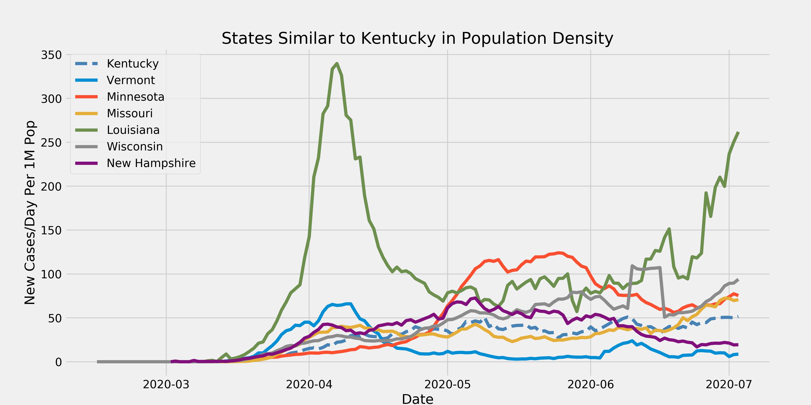

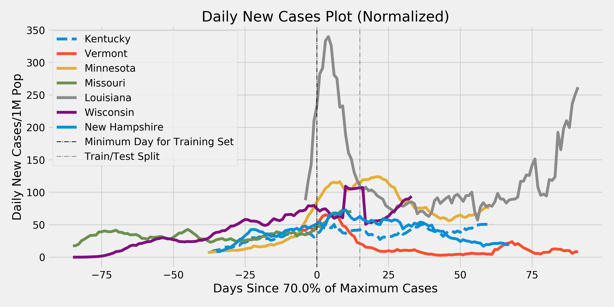

The model appears to perform pretty well for Kentucky. The general trend and values in the data are generally captured by the model.

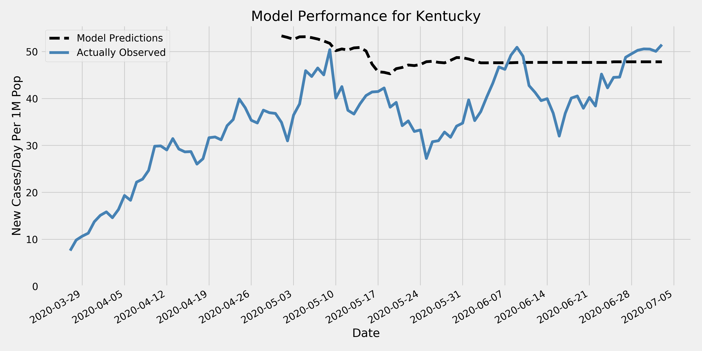

The top features for Kentucky, by far, are public activity in grocery stores/pharmacies and at parks.

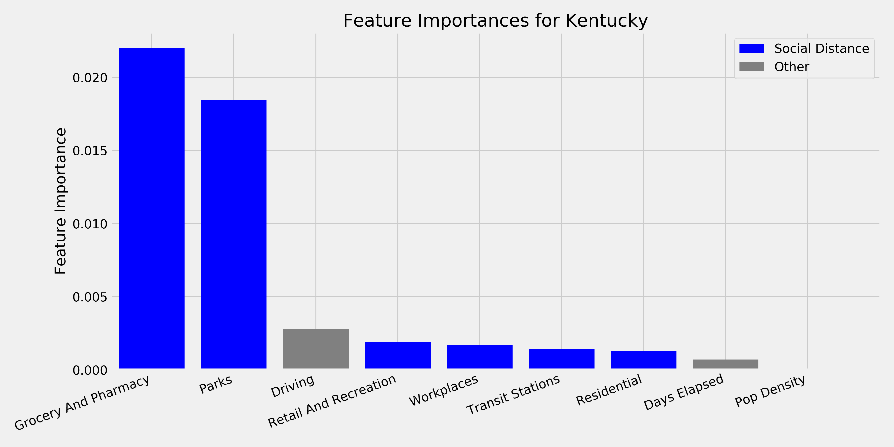

There seems to be a strange trend in the data that at higher levels new cases, a presence of 0.9 times as much as normal is correlated to a decrease in the number of new cases. This does not make sense and is likely due to the training data capturing Louisiana's data after the state recovered from its peak. Looking at the ice curves for activity in parks, there is a similar negative trend as activity in parks increases. Looking at the next most important social distancing feature of retail and recreation activity, if new daily cases exceed 150 per 1 million residents, transit stations should be limited to 53% of their normal capacity.

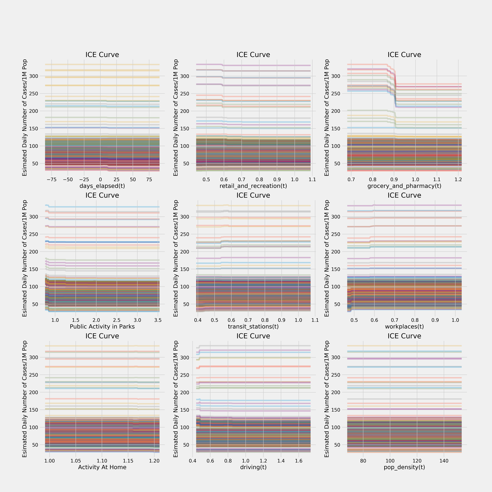

Shown below is a table of the maximum and minimum levels of social distancing found in the training set for Kentucky as a percentage of pre-pandemic levels (January 2020).

|                     |Retail/ Recreation %|Grocery/ Pharmacy %|Parks %|Transit Stations %|Workplaces %|Residential %|Driving %|
|---------------------|-------------------|------------------|-------|------------------|------------|-------------|---------|
|Low Public Activity  |44.3               |68.1              |75.6   |39.0              |46.6        |121.0        |44.0     |
|High Public Activity |109.0              |121.6             |353.9  |107.3             |103.1       |99.1         |173.4    |

Forecasting data out to the future, it appears that Kentucky is currently heading in the right direction to reduce the number of daily new cases. With a greater degree of social distancing, it could decrease even faster.

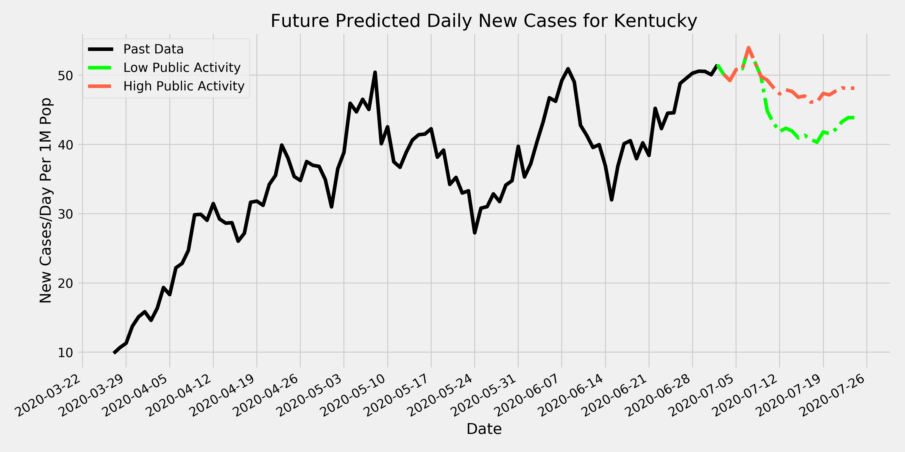

####  4.3. New Mexico

New Mexico is analyzed with states that are within plus or minus 30 people per square mile.

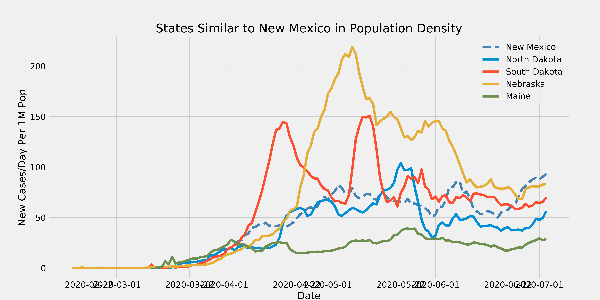

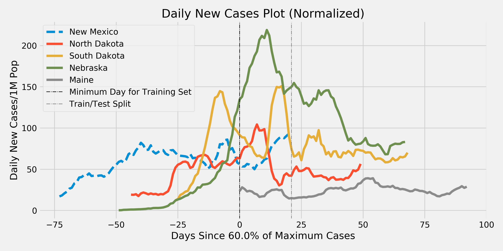

The model appears to fit the trends for New Mexico pretty well with the data from similar states.

The most important features for New Mexico are as shown.

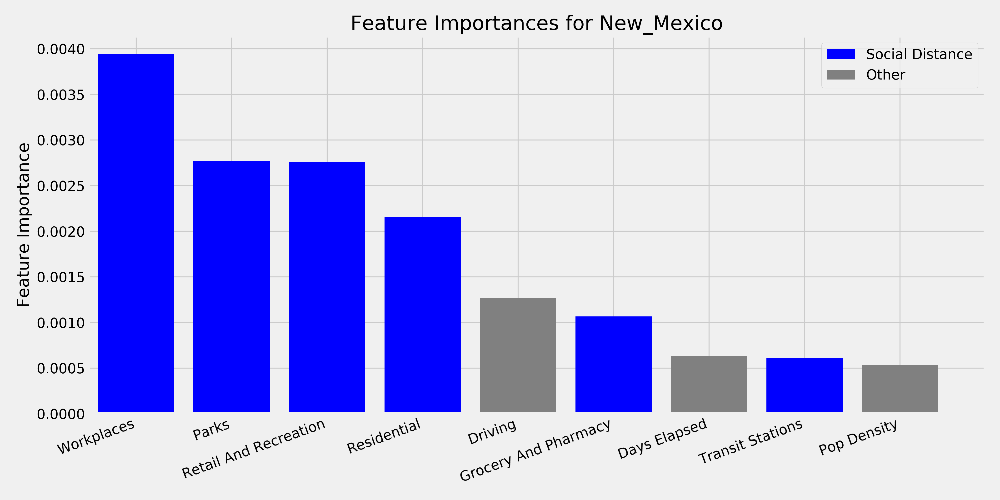

Based on the ICE curves, public activity in parks should be limited to about the same attendance as they were in January of this year to prevent the spread of COVID-19. Retail and recreation centers should be limited to 0.75 times as much as pre-pandemic levels, and people should stay home at least 11% as much as normal.

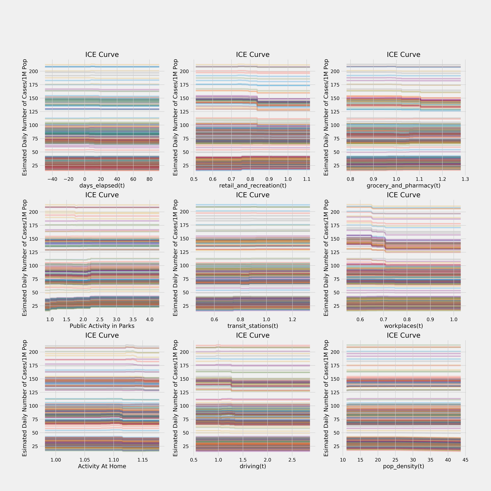

Forecasting the following data into the future shows a slight change in the number of new cases for New Mexico.

|                     |Retail/ Recreation %|Grocery/ Pharmacy %|Parks %|Transit Stations %|Workplaces %|Residential %|Driving %|
|---------------------|-------------------|------------------|-------|------------------|------------|-------------|---------|
|Low Public Activity  |51.0               |78.3              |85.0   |45.7              |54.1        |117.9        |54.1     |
|High Public Activity |111.7              |128.0             |428.4  |133.4             |103.0       |98.1         |286.2    |

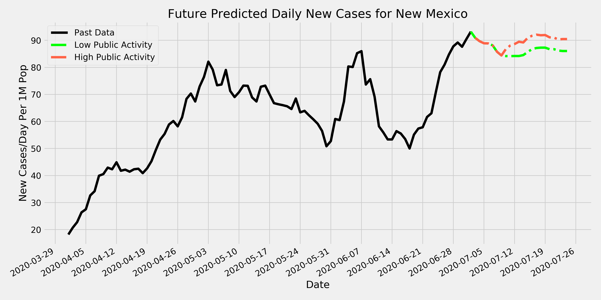

####  4.4. North Carolina

Shown below are the results when the model is applied to North Carolina with states with population densities within 35 people per square mile and a recovery factor of 1.2.

The model does a great job predicting the data for North Carolina, but overpredicts by a small amount.

Activity in parks, driving, and people staying at home seem to be the most important features for this state (Population density isn't something that can be changed so the focus will be on the next most important features).

Based on the ICE plots, park attendance in North Carolina should be limited to about 0.8 times as much as their typical capacity. Also, encouraging people to stay home 1.18 times as much as normal will likely help as well, but this could be relaxed once the number of cases gets down to about 75 new daily cases per 1 million residents.

Shown below is a table of the maximum and minimum levels of social distancing found in the training set for North Carolina as a percentage of pre-pandemic levels (January 2020).

|                     |Retail/ Recreation %|Grocery/ Pharmacy %|Parks %|Transit Stations %|Workplaces %|Residential %|Driving %|
|---------------------|-------------------|------------------|-------|------------------|------------|-------------|---------|
|Low Public Activity  |45.0               |67.4              |32.4   |28.9              |48.7        |122.1        |29.5     |
|High Public Activity |110.1              |127.3             |312.1  |107.0             |102.7       |98.6         |162.5    |

Unfortunately, it looks like the number of new cases in North Carolina is going to keep climbing for the foreseeable future according to this model. However, with low public activity, we see a small decrease in the near future. Considering that the model overpredicts, in reality we will likely see a slightly smaller number of new cases than shown.

####  4.5. Ohio

Ohio is another state currently at its maximum of daily new cases. A training set comprised of states within +/- 70 people per square mile that have shown some recovery are analyed below.

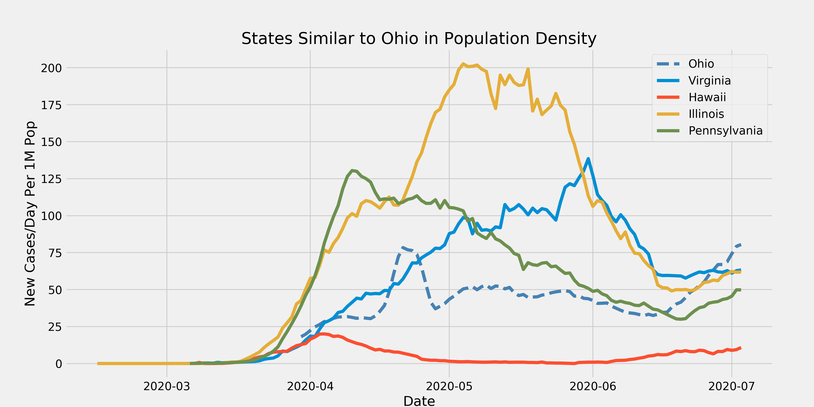

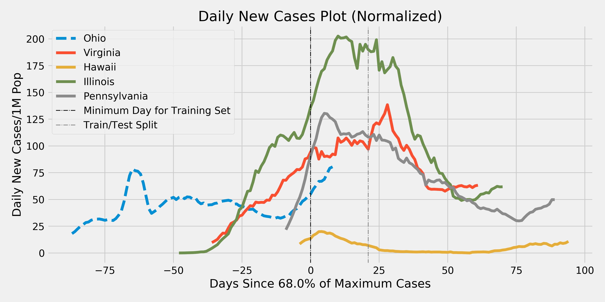

Ohio is an example of a state that the model overpredicts the number of new cases, probably because, in order to get a satisfactory subset of states, a fairly large population density tolerance had to be applied. However, the model does catch on to the general positive trend over time, so insights made using the model should still be valid.

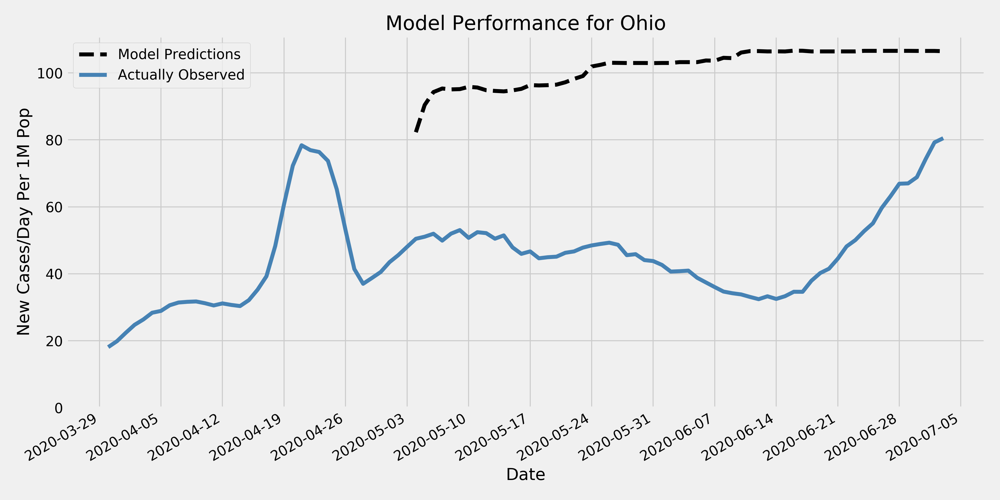

The most important social distancing features for Ohio are public activity in parks, driving, and residential presence. 

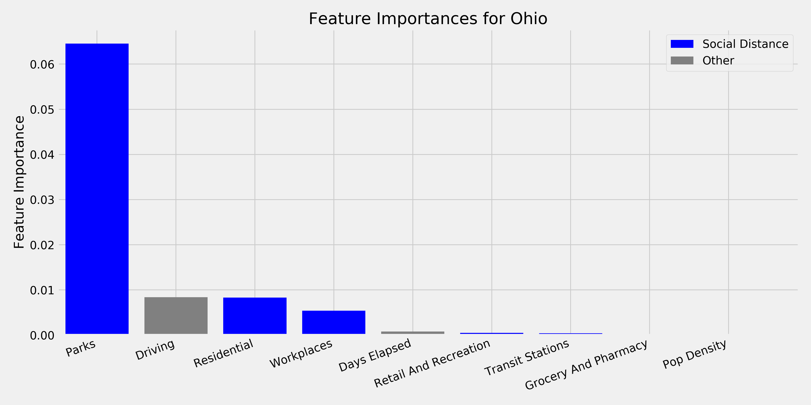

Looking at the ICE curves for Ohio, keeping park attendance below about 0.6 times as much as January 2020 levels is correlated with lower numbers of daily cases, so they should be limited as such for the foreseeable future. People should be encouraged to stay home at least 1.2 times as much as in January, but if the number of daily new cases exceeds about 140 per 1 million Ohio residents, staying home becomes even more critical and we start to see a benefit at 1.17 times as normal. 

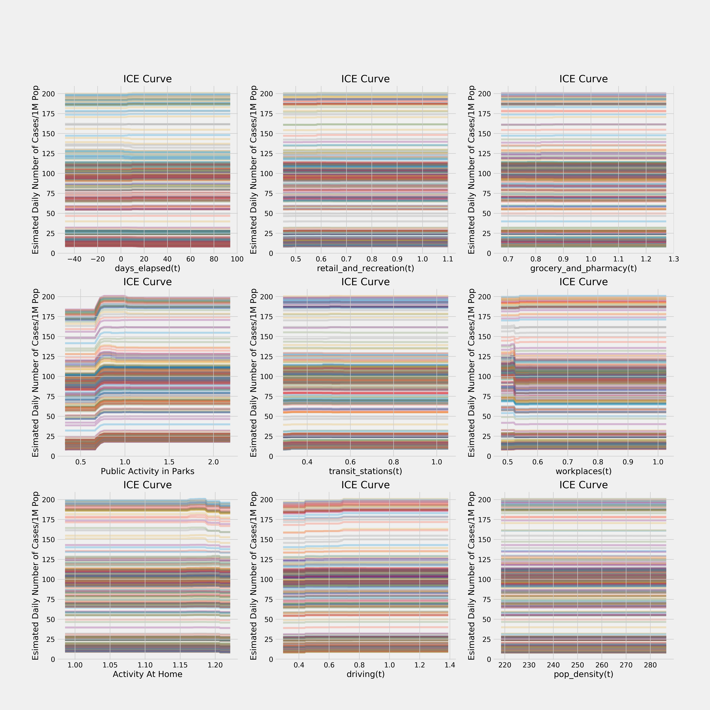

The minimum and maximum levels of public activity for the Ohio training set are shown below.

|                     |Retail/ Recreation %|Grocery/ Pharmacy %|Parks %|Transit Stations %|Workplaces %|Residential %|Driving %|
|---------------------|-------------------|------------------|-------|------------------|------------|-------------|---------|
|Low Public Activity  |45.0               |67.4              |32.4   |28.9              |47.9        |122.1        |29.5     |
|High Public Activity |110.1              |127.3             |218.9  |105.3             |102.7       |98.6         |138.9    |

Forecasting these values into the future, a greater level of public activity leads to a considerable increase in the number of new cases, but reducing public activity starts to show reduction in new cases right away. Since the model overpredicted the number of new cases in the performance plot, I don't believe we would see as much of an initial increase as shown in the plot, but the diversion between the low and high public activity predictions will likely be similar.

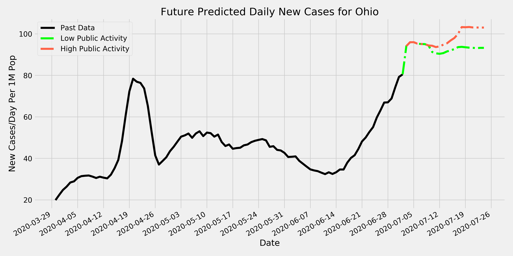

####  4.6. Oregon

States with a population density of +/- 15 people per square mile to Oregon are analyzed below to predict for Oregon.

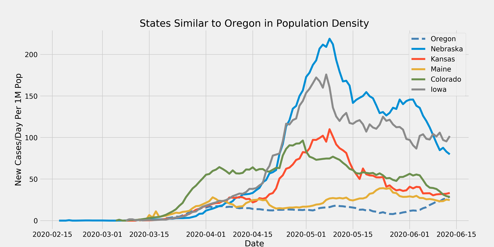

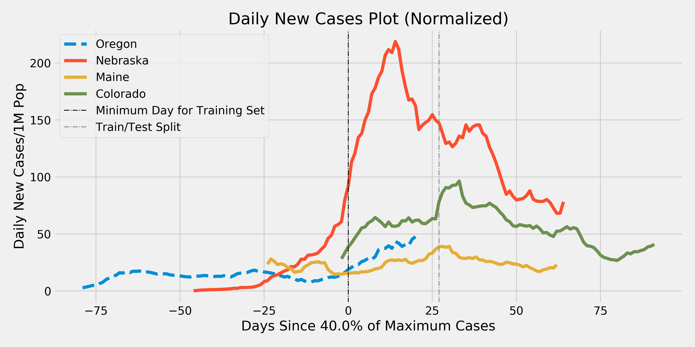

The catches on to the trend very well for most of Oregon's data. This instance was unique in that Oregon was included in the training set, as most similar states to Oregon had a much greater level of new cases, so the model was overpredicting at first, but now it predicts quite well.

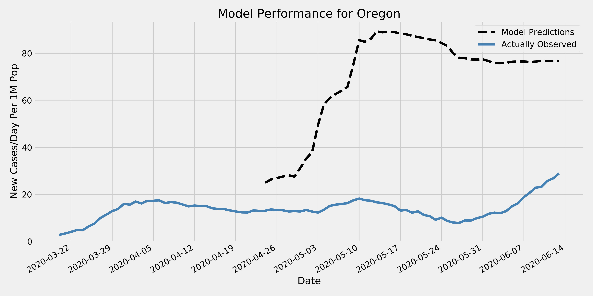

Activity at home seems to be the most significant feature for states similar to Oregon. This is followed by public activity at transit stations.

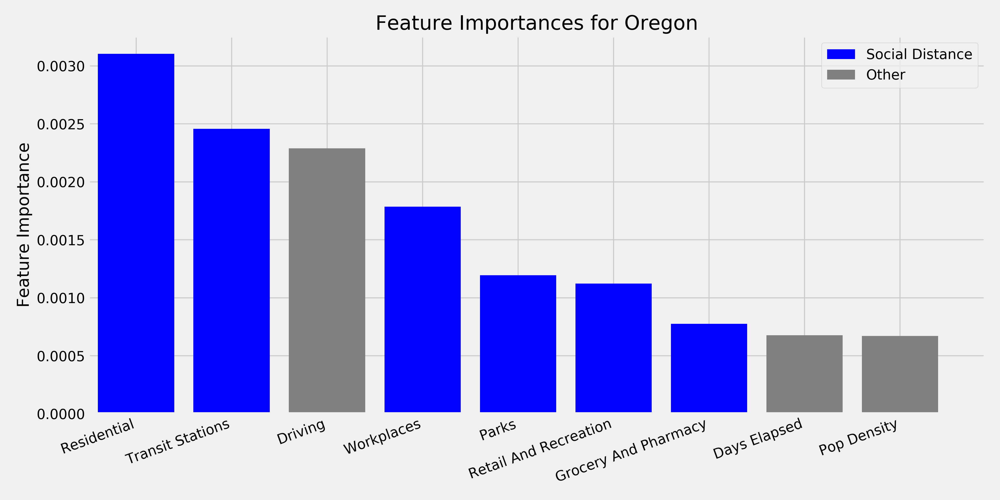

Based on the ICE curves below, people staying home at least 1.12 times as much as January 2020 sees a small reduction in the number of new cases expected. If we keep the attendance of transit stations less than 0.63 times as much as January 2020, there is also a small reduction in new cases, but if cases continue to rise it becomes more critical.

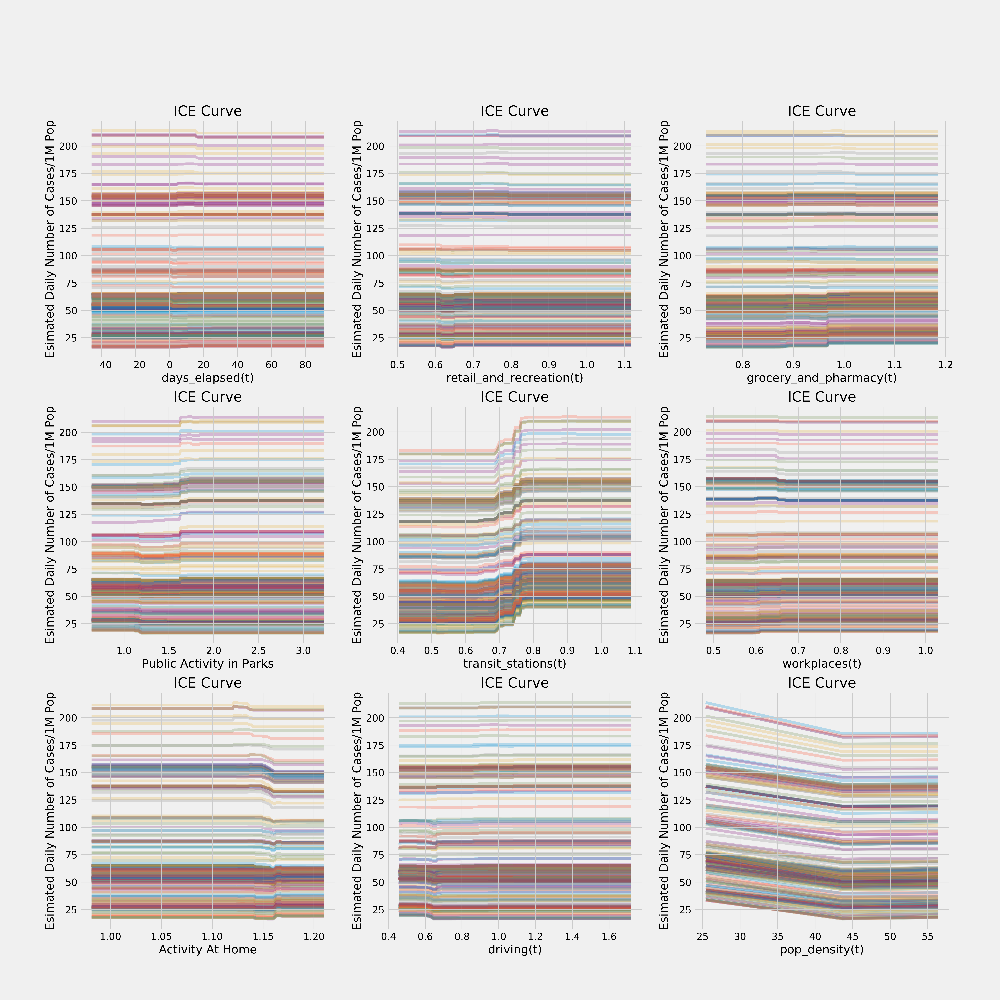

The minimum and maximum levels of public activity for the Oregon training set are shown below.

|                     |Retail/ Recreation %|Grocery/ Pharmacy %|Parks %|Transit Stations %|Workplaces %|Residential %|Driving %|
|---------------------|-------------------|------------------|-------|------------------|------------|-------------|---------|
|Low Public Activity  |50.3               |72.7              |63.7   |40.3              |48.1        |121.0        |45.5     |
|High Public Activity |108.3              |130.0             |345.0  |110.1             |102.1       |99.1         |179.4    |

Forecasting these values into the future shows a drastic increase in the number of new cases if social distancing is relaxed, but the curve appears to flatten with minimal public activity.

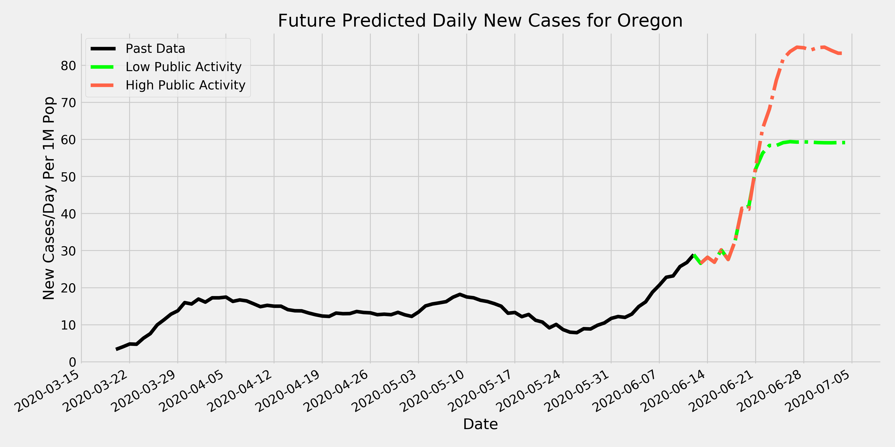

####  4.7. Tennessee

States similar to Tennessee (+/- 70 people per square mile) are analyzed below.

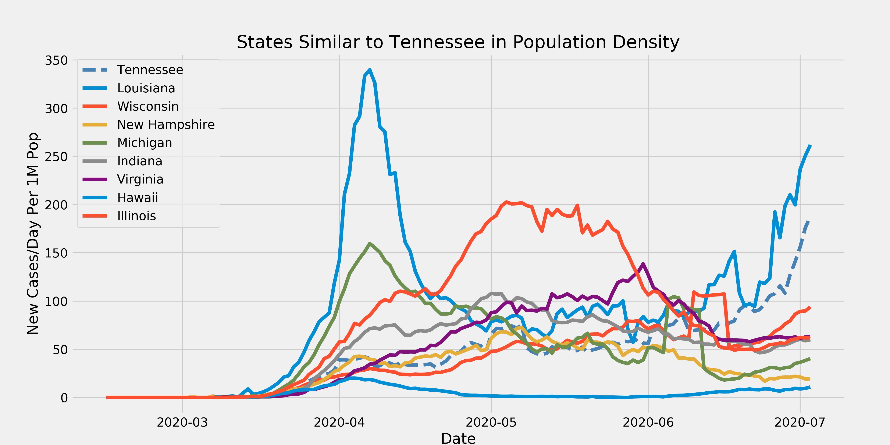

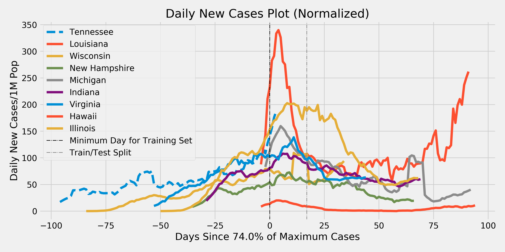

The model performs very well for Tennessee, though it underpredicts during the drastic recent spike in new cases.

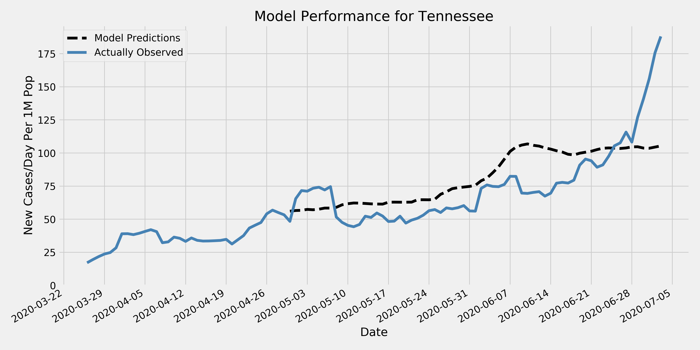

Public activity in workplaces seems to be the most significant feature for states similar to Oregon. This is followed by activity at transit stations.

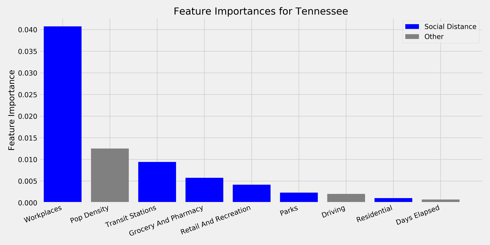

Based on the ICE curves below, since Tennessee is now seeing 175 new cases per day per million residents and has been increasing at a seemingly exponential rate, my reommendation would be to limit workplaces presence to 0.55 times as much as January 2020 levels. This can be done by encouraging non essential employees to work from home as much as possible. This can be revisited and possibly relaxed once the number of daily cases is reduced to less than 125 new cases per day per million residents. Similar recommendations can be made for transit stations in Tennessee: limit attendance to about 0.5 times as much as pre-pandemic levels until the number of new daily cases is reduced to less than 125 per million residents.

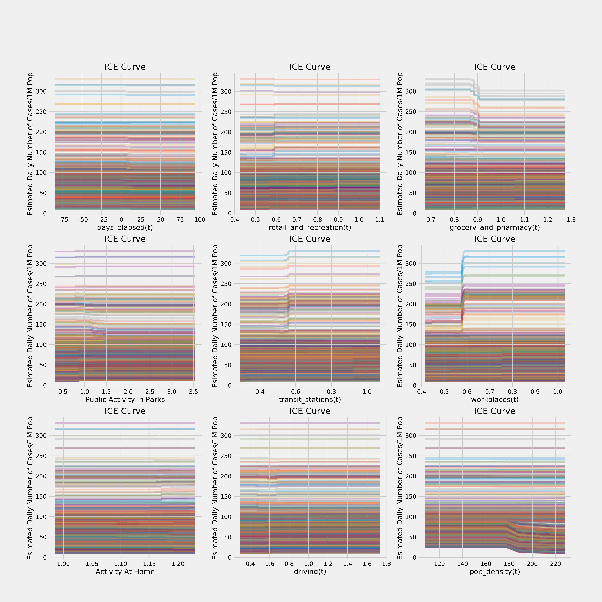

The minimum and maximum levels of public activity for the Tennessee training set are shown below.

|                     |Retail/ Recreation %|Grocery/ Pharmacy %|Parks %|Transit Stations %|Workplaces %|Residential %|Driving %|
|---------------------|-------------------|------------------|-------|------------------|------------|-------------|---------|
|Low Public Activity  |42.6               |67.4              |32.4   |28.9              |41.4        |123.0        |29.5     |
|High Public Activity |110.1              |127.3             |353.9  |107.3             |103.1       |98.6         |173.4    |

Forecasting these values out to the future, it looks the number of new cases is only going to increase, but we can begin to flatten the curve and reduce it significantly by minimizing public activity in Tennessee.

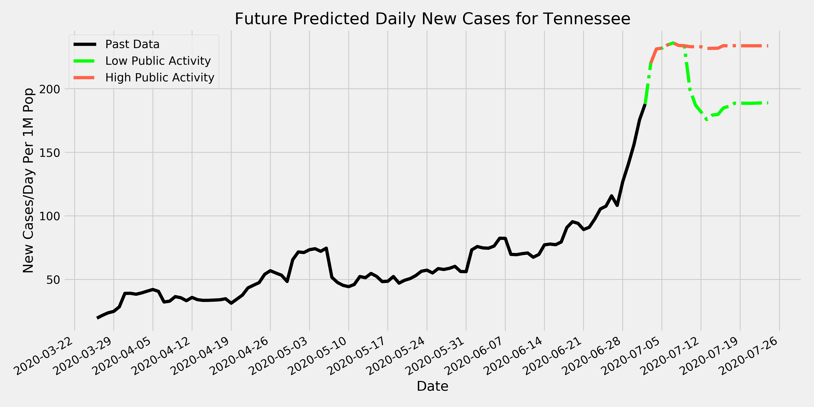

##  5. Conclusion
Unfortunately, it does not look like the occurrence of new cases of COVID-19 are going away anytime soon, though some states are much closer than others. Although everyone is eager to finally get out of the house after so long, it looks like social distancing is effective in preventing the spread of the virus with a time delay, and hopefully we will continue to see numbers go down further in the near future in the states currently struggling most with the virus, and another wave of infections can be avoided. However, even if there is another wave in infections, there is data that can be used to determine the extent of how social distancing should be maintained and the amount of an effect that it can have on the future number of cases.

##  6. Future Ideas for Improvement
- Replace states with counties and run county by county analysis (better results for varying population densities)
- Apply a scalar value to multiply the x axis on specific curves so that the shapes more closely resemble each other to improve results
- Pursue original goal of predicting economic recovery; forecast recovery out further and use recession unemployment data to forecast
- Import more features from other data sources:
    - Look at South Korea/Italy data or other recovered countries - use that to predict into future?
    - Bring in data from travel from other countries - maybe that would help?
        https://travel.trade.gov/view/m-2017-I-001/index.asp
    - Weather data - Rumors that the virus doesn't do well in warm/humid conditions
- Use web-scraping and NLP to analyze the type of words being used in recent economic news (ratio of words such as "lockdown", "quarantine", "extended" to words like "protest", "end", "open") to determine better scaling factors for prediction matrix 

##  7. Data Sources / References

Header image : https://spectrumlocalnews.com/nc/triangle-sandhills/tying-it-together-with-tim-boyum/2020/04/28/tying-it-together-with-tim-boyum-checking-the-pulse-on-nc-s-economic-health-during-the-coronavirus-crisis
https://www.xifin.com/resources/blog/202004/covid-19-maintaining-momentum-during-volume-recessions 

https://machinelearningmastery.com/convert-time-series-supervised-learning-problem-python/

https://github.com/nytimes/covid-19-data/blob/master/us-states.csv 

https://worldpopulationreview.com/states/

https://www.apple.com/covid19/mobility

https://www.google.com/covid19/mobility/index.html?hl=en 