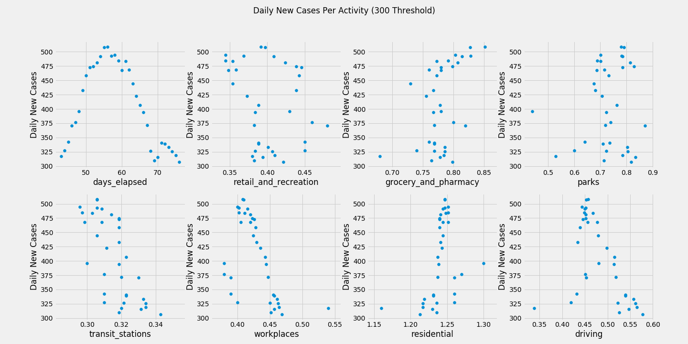

# Forecasting the Future of COVID-19 with Social Distancing 
The question on everyone's mind these days seems to be when will things go back to normal? The United States, as well as the rest of the world, has been hit hard by the COVID-19 pandemic and we are all hoping that the end is in sight. In this study, I attempt to predict the future number of new cases of the virus per day in New York and try to find an end in sight using data of how people are socially distancing.

## Data + Cleaning

I primarily used 3 different datasets for this study and combined them into a single DataFrame for analysis and prediction.

New York Times: Github Repo of cases/deaths daily per state
The New York Times offers dataset on the number of cases and deaths by COVID-19 per each state. I created a new column of daily new cases and divided these numbers by the state's population for a fairer comparison from state to state, resulting in new cases per 1 million residents. To smooth out the many spikes in the number of new cases per day, I used a 7 day moving average and used this as the target variable.

Apple: Mobility Data
Apple offers a dataset on mobility that breaks categories into walking, driving, and transit. Unfortunately, walking and transit data are only available on a national and/or city level so I was only able to get driving data from this set. These data are reported as compared to a percentage of the baseline value measured on January 13th - this number was converted by 100 to get a multiplier of normal for each day.

Google: Global Mobility Data
From Google, I was able to get a massive dataset detailing mobility trends througout the past few months at grocery stores/ pharmacies, parks, transit stations, retail/recreation outlets, residential, and workplaces. This data was reported as the percent change from the baseline, the median value, for the corresponding day of the week, during the 5-week period Jan 3–Feb 6, 2020. To make this measurement consistent with the apple data, I added 100 and divided by 100 to get a multiplier of normal for each day. I also used a 7 day moving average for these features as well, so that weekend trends were avoided and any correlation would be easier to see.

# Exploratory Data Analysis
Although there has been news about a shortage of tests being available for the virus in the USA, the data show a very heavy correlation between deaths and cases for New York, so I decided to focus on new cases instead of deaths, as there is earlier and more data available for cases.

I was originally going to do a subset of states, but in the interest of time had to specialize in only one. I sorted the data available by the maximum number of daily cases and plotted them. I chose New York because New York was the first to have new cases in the US, and one of the few to have shown a strong negative trend over time at some point in the data.

When I plotted the data, I noticed that there are numerous spikes in the data whereas the predicted trend should be based on the moving average. Considering this dataset covers a considerable amount of time and data before the outbreak, I decided not to use any training data below the threshold of 100 new daily cases per 1 million population. This is because this data features no new cases and no changes in social distancing. Using the data below the threshold could mislead the model.

Looking at plots of New Cases versus the amount of public activity, there seems to be a surprising negative trend between social distancing attributes and daily new cases per population. There seems to be a positive rate of of new cases to presence at home, which is also the opposite of what I was expecting.

In case I was mistakenly including too much early pandemic data that could be throwing off my results, I tried a threshold at 300 cases per million population instead, which yielded a less negative trend, but not a positive one either.

To get a better visual of how each mobility trend may relate to the new number of cases each day, I scaled each feature data point to a fraction of its maximum value in the interval closest to the peak of the plot. It definitely appears as though a decrease in activity to various venues is followed by a decrease in new cases. Something noteable I found is that there are several spikes in outside activity from days 65-70 and a temporary increase in new cases. It definitely appears that social distancing effects the number of new cases, but with a time lag, which is likely why these trends were not as apparent on the scatter matrices.

Something notable is that there seems to be an explosion in activity in the later portion of the data, concurrent with a sharp decrease in the number of new cases. Looking at previous trends, I don't think converging to 0 anytime soon is going to be very likely.

## Forecasting
In order to set up a regression model and predict future values, I converted my original dataframe into a time series matrix and I decided to use a prediction of 20 days using the moving average data points as this seemed like a large enough interval to cover any cause-effects between the features and the target that may be lagging behind. The time series ended up with about 188 features in all, so I decided to use a random forest on my model as it can support high dimensionality with high accuracy.

Feature importances were determined below by summing all previous time series individual feature importances for the 20 day time lag into each specific category. 

I split the data into a training and testing group. Training data was used from the threshold to day 70, and Test Data was used from day 70 to the last known point.

Looking at the performance of the model on the testing set, it doesn't appear to be a great fit. Of course, it is very difficult to model this, and given the large shift in activity from the later part of the dataset, it makes sense that the model would predict a surge in the number of daily new cases.

I used my model to predict values out 20 days from the last known data point, this brings us to around the end of May. Using a prediction matrix with different set levels of activity, it does look like a high degree of social distancing and staying home will reduce the number of cases, but we still a long way from 0. 

## Conclusion
Unfortunately, it does not look like the occurrence of new cases of COVID-19 are going away anytime soon. Although everyone is eager to finally get out of the house after so long, it looks like social distancing is effective in preventing the spread of the virus, with a time delay, and hopefully we will continue to see numbers go down further in the near future.

## Future Plans/Ideas for improvement
- 1. Normalize the model, so that it can be used for other states as well, monitor other states
- 2. Use deaths instead of cases to ensure consistency across states?
- 3. Convert Days since February 15th back into actual month/dates, fix moving_average label to new cases/deaths, break code up into several scripts, fix forecasting model, learn/use tsfresh?
- 4. Provide sample of X and y matrices
- 5. Experiment using different thresholds for training/test split, modify parameters for random forest (max_depth, gini/entropy, etc), add evidence for these choices]
- 6. Pursue original goal of predicting economic recovery; forecast recovery out further and use recession unemployment data to forecast
- 7. Forecast out futher; hopefully will be able to pinpoint a recovery date range
- 8. Provide better/varying parameters for prediction matrix - mobility parameters were assumed constant for predicted future
- 9. Consider trying other regression models
- 10. Import more features from other data sources:
    - Look at South Korea data - use that to predict into future?
    - Bring in data from travel from other countries - maybe that would help?
        https://travel.trade.gov/view/m-2017-I-001/index.asp
    - Weather data - Rumors that the virus doesn't do well in warm/humid conditions
- 11. Use web-scraping and NLP to analyze the type of words being used in recent economic news (ratio of words such as "lockdown", "quarantine", "extended" to words like "protest", "end", "open") to determine better scaling factors for my prediction matrix. 

## Data Sources:

Header image : https://spectrumlocalnews.com/nc/triangle-sandhills/tying-it-together-with-tim-boyum/2020/04/28/tying-it-together-with-tim-boyum-checking-the-pulse-on-nc-s-economic-health-during-the-coronavirus-crisis

https://github.com/nytimes/covid-19-data/blob/master/us-states.csv 

https://worldpopulationreview.com/states/

https://worldpopulationreview.com/states/states-by-area/