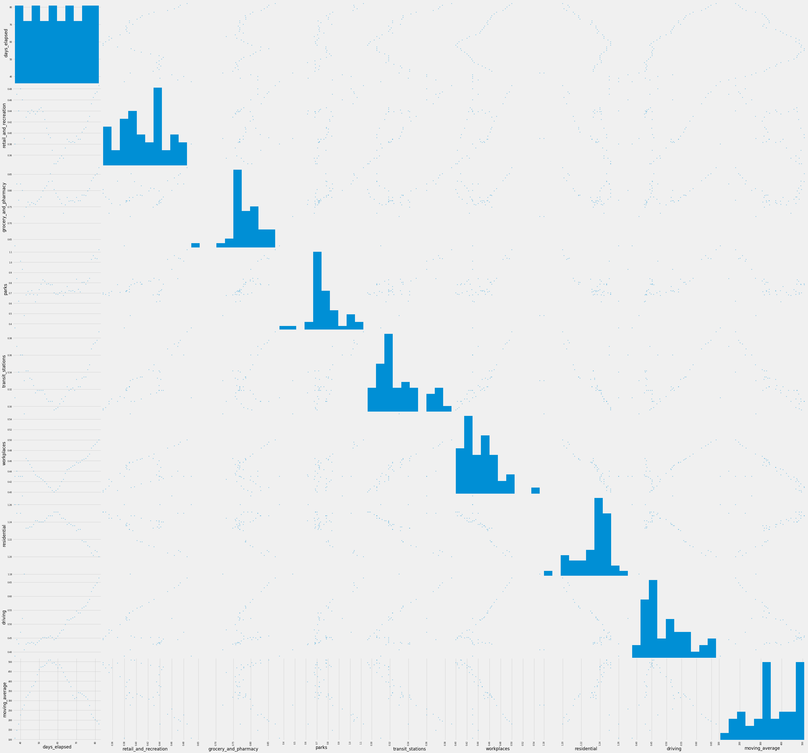
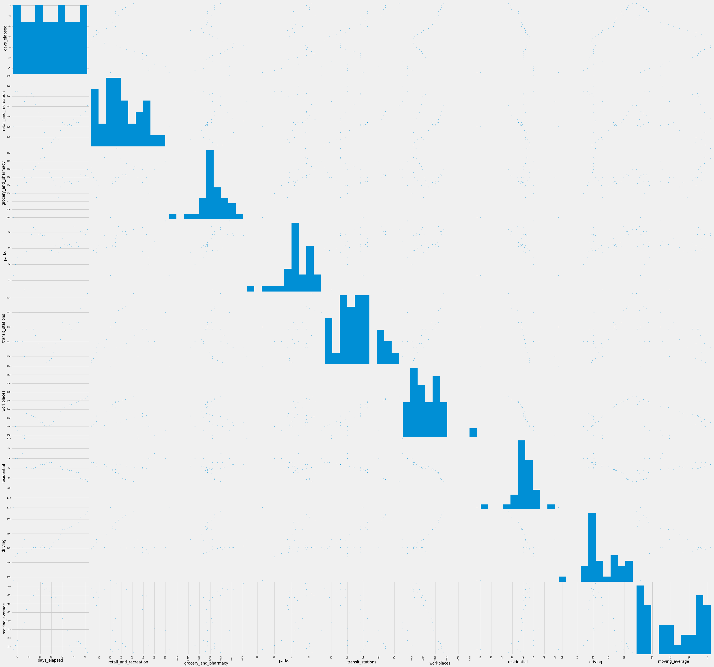

## Forecasting the Future of Covid 19 with Social Distancing 
The recent pandemic that has struck the world has been The question on everyone's minds is when will things go back to normal in the United States from the Covid-19 pandemic? In this Capstone I attempt to predict the future number of new cases of the virus per day in New York. 

# Data + Cleaning
New York Times: Github Repo of cases/deaths daily per state
The New York Times offers dataset on the number of cases and deaths by Covid-19 per each state. I created a new column of daily new cases and divided these numbers by the state's population for a fairer comparison from state to state, resulting in new cases per 1 million residents.

Apple: Mobility Data
Apple offers a dataset on mobility that breaks categories into walking, driving, and transit. Unfortunately, walking and transit data are only available on a national and/or city level so I was only able to get driving data from this set. These data are reported as compared to a percentage of the baseline value measured on January 13th - this number was converted by 100 to get a multiplier of normal for each day.

Google: Global Mobility Data
From Google, I was able to get a massive dataset detailing mobility trends througout the past few months at grocery stores/ pharmacies, parks, transit stations, retail/recreation outlets, residential, and workplaces. This data was reported as the percent change from the baseline, the median value, for the corresponding day of the week, during the 5-week period Jan 3–Feb 6, 2020. To make this measurement consistent with the apple data, I added 100 and divided by 100 to get a multiplier of normal for each day.

# Exploratory Data Analysis

# Forecasting

# Conclusion

# Future Plans/Ideas for improvement
- Consider other models
- Import more features from other data sources:
    - Look at South Korea data - use that to predict into future?
    - Bring in data from travel from other countries - maybe that would help?
        https://travel.trade.gov/view/m-2017-I-001/index.asp
- Monitor additional states
- Forecast out futher; hopefully will be able to pinpoint a recovery date range
- Pursue original goal of predicting economic recovery; forecast recovery out further and use recession unemployment data to forecast recovery
- Use web-scraping and NLP to analyze the type of words being used in recent economic news (ratio of words such as "lockdown", "quarantine", "extended" to words like "protest", "end", "open") to determine better scaling factors for my prediction matrix 

# Data Sources:

Header image : https://spectrumlocalnews.com/nc/triangle-sandhills/tying-it-together-with-tim-boyum/2020/04/28/tying-it-together-with-tim-boyum-checking-the-pulse-on-nc-s-economic-health-during-the-coronavirus-crisis

https://github.com/nytimes/covid-19-data/blob/master/us-states.csv 

https://worldpopulationreview.com/states/

https://worldpopulationreview.com/states/states-by-area/